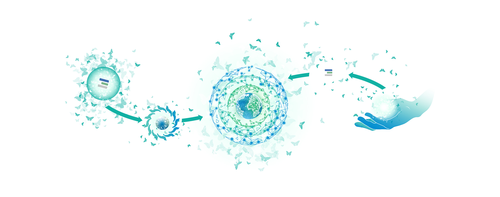

<!-- section 1 (step 1) -->



 
 
 

## We declare a New Conscious Internet

 

In line with FreeFlow Nation's vision we are building a framework for a better way forward for our planet by reducing dependencies on flawed and biased centralized systems putting people back in control of their lives.

 

 
 
 



<!-- section 2 (step 2) -->



 
 
 

## Rights





 

### Equal Chances

Everyone can deliver services or products to everyone in all transparency and fairness. Everyone can charge fair costs in relation to their added value. Information should never be created to deceive people. Information must be fact-based and transparent empowering people equally.

 

In line with FreeFlow Nation's vision we are building a framework for a better way forward for our planet by reducing dependencies on flawed and biased centralized systems putting people back in control of their lives.

|||

 

### Safe Environment

Health and safety are human rights. Everyone deserves equal access to affordable education, healthcare, financial systems, and Internet across geographical and cultural borders. The power lies in collaboration. It is our responsibility to produce high quality and sustainable products and services.

|||

 

### No Manipulation

Every digital citizen must have sole ownership of their created information and content. An author’s identity should always be verifiable unless an author wants to be anonymous. Everyone must have absolute freedom to decide what they want to share, and with whom they want to share it.

 
 
 



<!-- section 3 (step 3) -->



## Declaration





#### I declare that I have POWER and I need to act NOW

 

I believe that I have the power.
I won't blame others – governments, society, neighbors etc.
I am, as we all, at the source of the problems the world is facing today.
I have a responsibility to improve the things I can have an impact on.
I can still strive for a comfortable life but I also have to act and help heal the world. If I change my actions towards what I can have a positive impact on, the world will be a better place tomorrow.

|||

#### I declare that RESPECT is the basis of my communication and ACTION

 

I declare that respect instead of fear or ego, is the basis of my communication and my action in the new digital world.
I don't have to always agree but respect and tolerance for other opinions is a must.
I need to respect time, e.g. time of others and my own.

|||

#### I declare to respect the world's finite RESOURCES

 

I need to be respectful of finite world resources therefore I declare that I will use and produce high quality and sustainable products and services.​​​​​​​ 
I will actively look to choose and support more sustainable alternatives in the digital world (as much as physical) educating myself and considering the energy consumption and affect on our plane by digital tools I choose to use.





#### I declare to produce FAIR and HONEST information

 

I will be critical about the information I face and consume. 
I will create information which is in line with reality.
I will never create or endorse information to deceive people.

|||

#### I declare that NO one should ever be a product

 

I have become a product of a big data machine. Every action I take on social media, Internet searches, etc., is a potential profit for someone else. 
I will stop believing that we are getting these services for free. This leads to manipulation and too much of a consumption of our world's resources.
This means I accept to pay for resources I use.
This means I not only stop being a product myself but will never make another human (or any being) into a product.

 
 
 



<!-- section 3 (cta) -->



 
 
 

## If not Us, Who? If not Now, When?

 

<button>[Join Us](mailto:info@threefold.io)</button>

 
 
 

