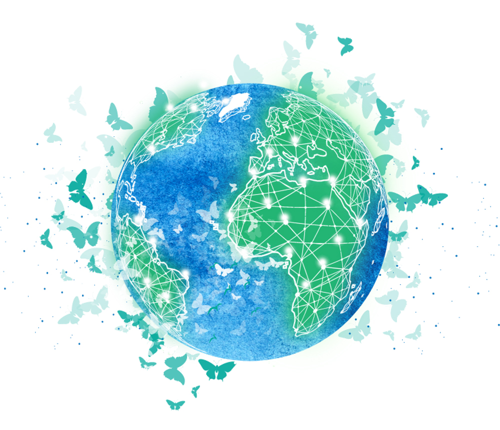
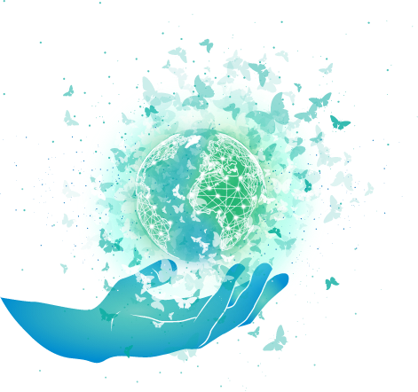

<!-- section 1 (header) -->



 
 
 

# Alliance for a Conscious Internet

 

A planetary movement of people and organisations that take action now to shape a conscious digital world that empowers everyone equally, across borders.

 

|||

 
 
 

 

 
 
 



<!-- section 2 (how it works) -->



|||

 

We aim to empower 1+ Billion people with access to the internet allowing everyone a chance to exchange value, goods and information for less than $1 per month.

 

Independent of location, race, gender, religion, we leave no one behind so that everyone can deliver services and goods to everyone in all transparency and fairness.

 

Instead of competing, we collaborate with one another to improve our solutions, efficiency, reach, visibility and our service to the planet and humanity.

 
 
 



<!-- section 3 (cta) -->



 
 
 

## If not Us, Who? If not Now, When?

 

<button>[Join Us](mailto:info@threefold.io)</button>

 
 
 

